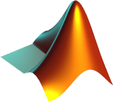

     
    <h1 class="title">Matlab Tutorials</h1>

<h3 align="center">Repository with every code used in Matlab Tutorials Videos:</h3>

<ol>
    <li>
        <a href="https://github.com/sElton42/Matlab-Tutorials/tree/master/How%20to%20Make%20GIFs%20-%20Animated%20Plot">
        How to Make GIFs | Animated Plot
        </a>
    </li>
</ol>
    
 
